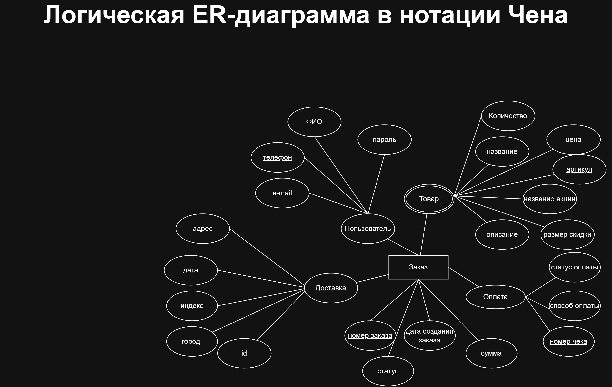
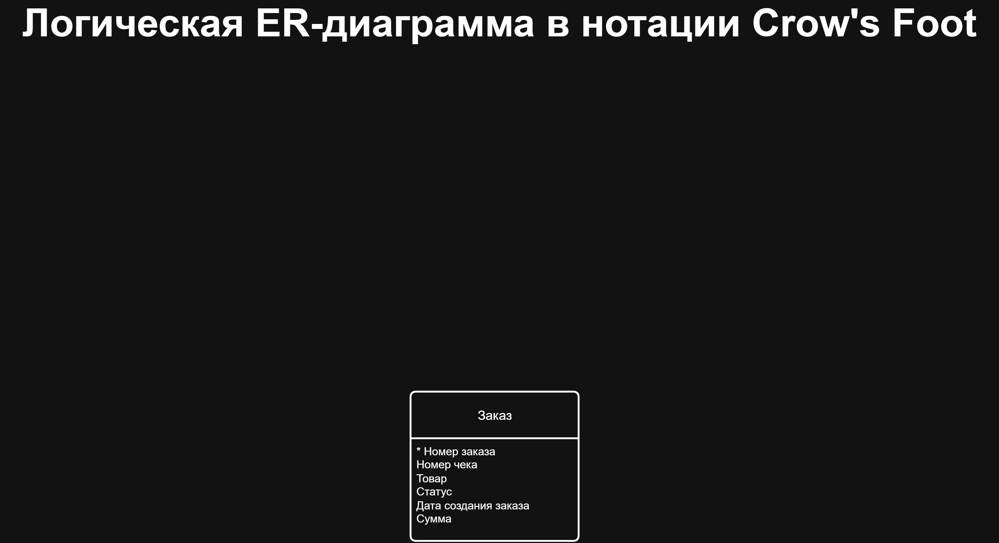
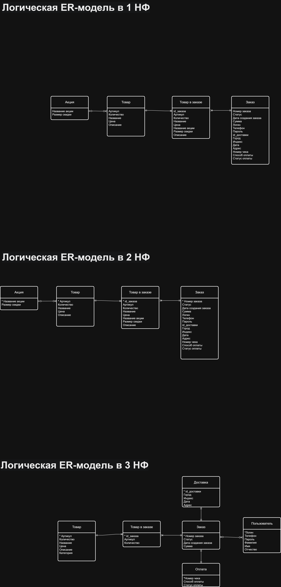

# Data Modeling — Order Management System

### Use Case • ER Modeling • Chen • Crow's Foot • Normalization

## 📌 О проекте

Проект моделирования данных для интернет-магазина.

В рамках проекта была выполнена последовательная проработка
модели системы: от определения пользовательских сценариев
до построения и нормализации логической ER-модели.

## 🎯 Цель проекта

Разработать логическую модель данных системы управления заказами
и привести её к нормализованному виду.

## 🔄 Этапы проекта

### 1. Use Case

Определены основные действующие лица и варианты использования
системы интернет-магазина.

Основные сценарии включают:

- работу пользователя с каталогом товаров;
- просмотр информации о товаре;
- оформление заказа;
- работу с личным кабинетом;
- управление данными заказа.

---

### 2. ER-модель — нотация Чена

На основе требований построена логическая ER-модель
в нотации Чена.

Определены основные сущности, атрибуты и связи между ними.

---

### 3. ER-модель — Crow's Foot

Полученная модель представлена в нотации Crow's Foot
с отображением связей и кардинальности между сущностями.

---

### 4. Нормализация модели

Выполнена последовательная нормализация логической модели
до третьей нормальной формы (3НФ).

В процессе нормализации:

- устранены повторяющиеся группы данных;
- выделены отдельные сущности;
- устранены зависимости неключевых атрибутов;
- определены связи между сущностями;
- уточнены первичные и внешние ключи.

---

## 🗂 Основные сущности

В модели представлены сущности, связанные с:

- пользователями;
- товарами;
- заказами;
- товарами в заказе;
- доставкой;
- оплатой.

## 🛠 Использованные подходы

- Use Case
- ER-моделирование
- Нотация Чена
- Crow's Foot
- Нормализация данных
- 1НФ
- 2НФ
- 3НФ
- Логическое моделирование данных

## 📎 Артефакты

Все основные диаграммы проекта находятся в папке
[`diagrams`](./diagrams/).
