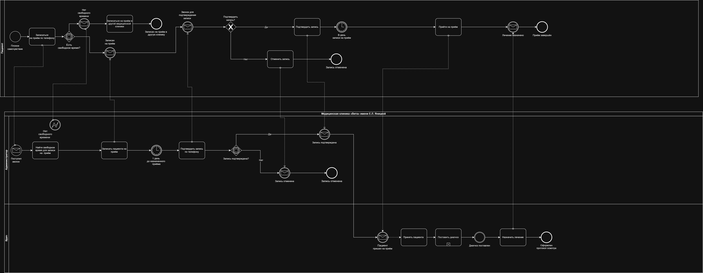
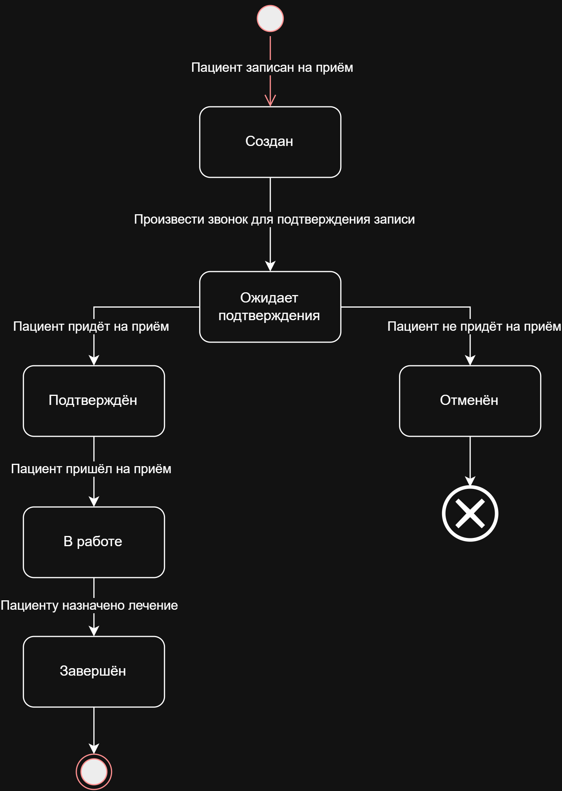
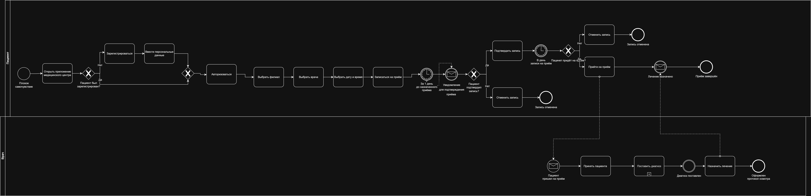

# Medical Clinic — Process Modeling

### BPMN • UML State Machine • AS-IS / TO-BE • Process Automation

## 📌 О проекте

Проект моделирования процесса записи пациента и приёма у врача
в медицинской клинике.

В рамках проекта проанализирован текущий процесс взаимодействия
пациента, администратора и врача, определены состояния записи
на приём и разработана целевая модель процесса с автоматизацией
записи через мобильное приложение клиники.

## 🎯 Цель проекта

Проанализировать текущий процесс записи пациента на приём,
выявить возможности автоматизации и разработать целевую модель
процесса (TO-BE).

## 🔎 AS-IS процесс

Текущий процесс предполагает взаимодействие пациента
с администратором по телефону.

Основные этапы:

1. Пациент обращается в клинику.
2. Администратор проверяет наличие свободного времени.
3. Пациент выбирает врача и время приёма.
4. Администратор создаёт запись.
5. Перед приёмом администратор связывается с пациентом
   для подтверждения записи.
6. Пациент подтверждает или отменяет запись.
7. В день приёма врач проводит осмотр.
8. Врач фиксирует результаты осмотра и назначенное лечение.
9. Приём завершается.

### BPMN AS-IS

## 🔄 UML State Machine

Для объекта «Запись на приём» выделены основные состояния:

- Создан;
- Ожидает подтверждения;
- Подтверждён;
- Отменён;
- В работе;
- Завершён.

Переходы между состояниями определяются действиями пациента,
администратора и врача.

## 🤖 Возможности автоматизации

В ходе анализа процесса определены операции, которые могут быть
перенесены в приложение:

- регистрация пациента;
- поиск врача;
- просмотр свободных слотов;
- выбор даты и времени приёма;
- самостоятельная запись пациента;
- подтверждение записи;
- отмена записи;
- уведомление пациента;
- передача информации о записи врачу.

Автоматизация позволяет сократить ручное взаимодействие
пациента с администратором при записи на приём.

## 🚀 TO-BE процесс

В целевой модели пациент самостоятельно взаимодействует
с приложением клиники.

Основной сценарий:

1. Пациент открывает приложение.
2. При необходимости регистрируется и вводит персональные данные.
3. Выбирает филиал и врача.
4. Просматривает доступные даты и время.
5. Выбирает подходящий слот.
6. Создаёт запись.
7. Подтверждает запись.
8. Получает уведомление о записи.
9. В назначенное время приходит на приём.
10. Врач принимает пациента и фиксирует результаты приёма.

Роль администратора в целевом процессе записи исключается,
а операции выполняются через приложение.

### BPMN TO-BE

## 📊 Результат анализа

В результате моделирования:

- описан текущий AS-IS процесс;
- определены роли участников процесса;
- выделены состояния записи на приём;
- определены переходы между состояниями;
- выявлены операции, подходящие для автоматизации;
- разработан целевой TO-BE процесс;
- определено изменение роли администратора в процессе записи.

## 🛠 Использованные нотации

- BPMN 2.0
- UML State Machine Diagram
- AS-IS / TO-BE modeling
- Process Analysis
- Process Automation

## 👤 Моя роль

**Системный аналитик**

В рамках проекта выполнял:

- анализ бизнес-процесса;
- анализ интервью заинтересованных сторон;
- моделирование AS-IS процесса;
- определение состояний и переходов;
- анализ возможностей автоматизации;
- разработку TO-BE процесса;
- моделирование взаимодействия участников процесса.

## 📎 Артефакты

Все диаграммы проекта находятся в папке
[`diagrams`](./diagrams/).
