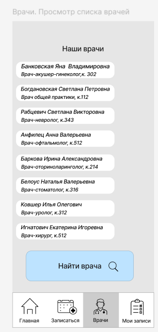
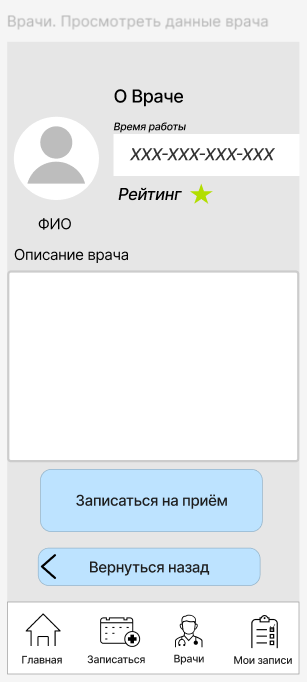
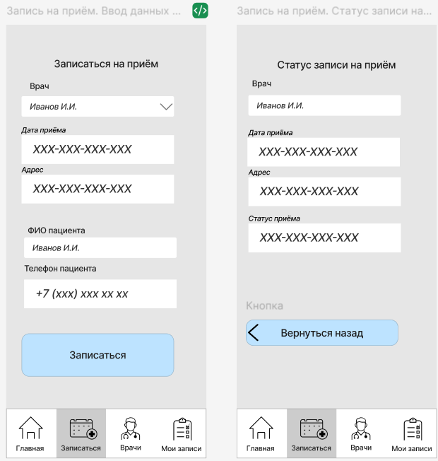
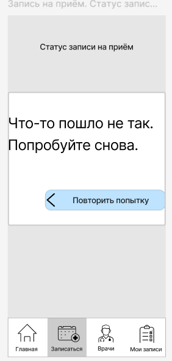
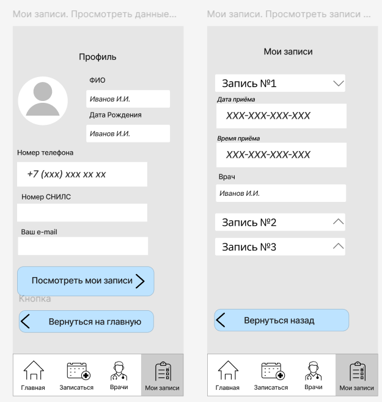

# Medical Clinic — UI Storyboard

### UI Storyboard • Wireframes • User Flow • Figma Prototype

## 📌 О проекте

Проект разработки раскадровки пользовательского интерфейса
мобильного приложения сети медицинских клиник.

Приложение позволяет пациентам просматривать информацию о врачах,
выбирать специалиста и записываться на приём, а также просматривать
запланированные визиты.

В рамках проекта на основании DFD и структуры интерфейса были
определены необходимые экраны приложения и разработаны wireframes.

## 🎯 Цель проекта

Показать предполагаемый пользовательский путь пациента
и определить структуру основных экранов мобильного приложения
до этапа разработки финального UI-дизайна.

## 🔄 Основной пользовательский сценарий

Пользователь:

1. Открывает приложение.
2. Просматривает список врачей.
3. Выбирает интересующего специалиста.
4. Просматривает информацию о враче.
5. Выбирает подходящую дату и время.
6. Вводит данные для записи.
7. Подтверждает запись.
8. Просматривает запланированные визиты.

## 🖼️ Wireframes

### Список врачей

### Профиль врача

### Данные для записи

### Подтверждение записи

### Запланированные визиты

## 🧩 Что было проработано

- структура экранов приложения;
- пользовательский сценарий записи к врачу;
- состав данных, необходимых для записи;
- навигация между экранами;
- wireframes;
- основные элементы интерфейса;
- пользовательские переходы;
- кликабельный прототип.

## 🛠 Использованные инструменты и подходы

- Figma
- Wireframing
- UI Storyboarding
- User Flow
- DFD
- Prototyping
- UI requirements analysis

## 👤 Моя роль

**Системный аналитик**

В рамках проекта:

- проанализировал DFD;
- определил функции приложения;
- определил необходимые экраны;
- сформировал пользовательский сценарий;
- определил данные, необходимые для выполнения операций;
- разработал wireframes;
- связал экраны в интерактивный прототип.

## 🔗 Figma Prototype

[Открыть проект в Figma](https://www.figma.com/design/XPo57Fmzu5UkPLdHfOgjOG/%D0%94%D0%97-%D0%A1%D0%BF%D1%80%D0%B8%D0%BD%D1%82-6-v.2--Copy-?node-id=0-1&t=CbMxZUbj8GT5uuBd-1)

## 📎 Артефакты

- UI Storyboard
- Wireframes
- User Flow
- Interactive Figma Prototype
