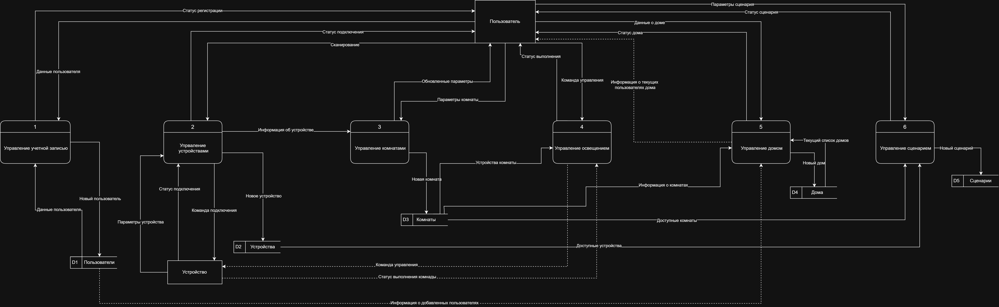
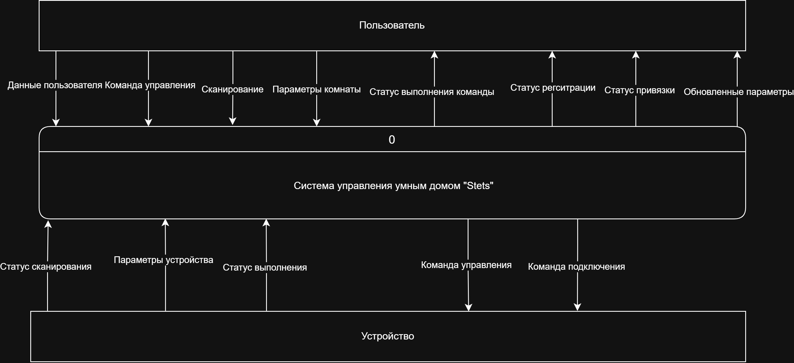
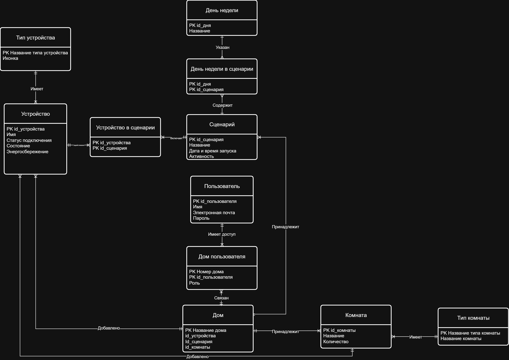
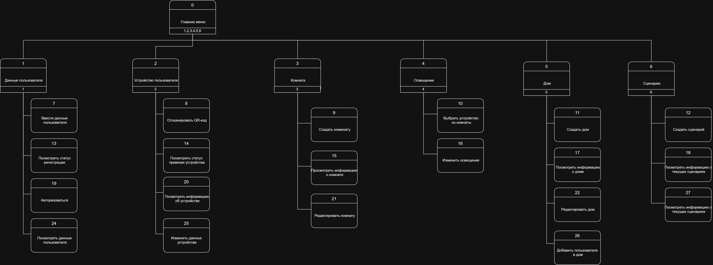

## 📌 О проекте

Stets Home — проект мобильного приложения для управления
устройствами умного дома.

Проект выполнен в несколько этапов: от анализа требований
и моделирования предметной области до разработки прототипа
и подготовки программы и методики испытаний.

Основная задача — формализовать требования к системе,
определить состав MVP, смоделировать процессы и данные,
разработать структуру интерфейсов и подготовить прототип
для последующей проверки требований.

---

## 🎯 Цель проекта

Разработать и формализовать первую версию системы управления
умным домом Stets Home.

В рамках проекта были:

- проанализированы потребности пользователей;
- определены пользовательские сценарии;
- выделен MVP;
- разработаны модели процессов и данных;
- определена структура интерфейсов;
- разработан интерактивный прототип;
- подготовлена программа и методика испытаний.

---

# 1. Анализ требований

## 👥 Пользовательские персоны

В рамках анализа были выделены две основные персоны:

### Михаил

Пользователь, который недавно приобрёл квартиру и хочет
управлять устройствами умного дома через мобильное приложение.

Основные потребности:

- простое управление устройствами;
- управление освещением;
- энергосбережение;
- понятный интерфейс.

### Алёна

Опытный пользователь устройств умного дома с большим количеством
Stets-устройств.

Основные потребности:

- централизованное управление устройствами;
- настройка дома под себя;
- автоматизация;
- работа с большим количеством устройств.

---

## 🗺 User Story Map

На основании потребностей пользователей сформирована карта
пользовательских историй.

На карте определены:

- основные пользовательские активности;
- пользовательские задачи;
- пользовательские истории;
- MVP первой версии;
- критерии и сценарии приёмки.

---

# 2. Моделирование системы

## 🔄 DFD

Для описания потоков данных разработаны:

- логическая DFD;
- физическая DFD.

Логическая модель декомпозирует систему на основные процессы:

1. Управление учётной записью.
2. Управление устройствами.
3. Управление комнатами.
4. Управление освещением.
5. Управление домом.
6. Управление сценариями.

### Логическая DFD

### Физическая DFD

---

# 3. Моделирование данных

## 🗃 ER-модель

Разработана логическая ER-модель предметной области
в нотации Crow's Foot.

В модели представлены основные сущности:

- Пользователь;
- Дом;
- Дом пользователя;
- Комната;
- Тип комнаты;
- Устройство;
- Тип устройства;
- Сценарий;
- День недели;
- День недели в сценарии;
- Устройство в сценарии.

Модель использована для определения структуры данных
и взаимосвязей между объектами системы.

### ER Diagram

---

## 📖 Словарь данных

Для сущностей и атрибутов модели разработан словарь данных.

Для каждого элемента определены:

- название;
- назначение;
- тип данных;
- длина;
- допустимые значения.

[Открыть словарь данных](./docs/data-dictionary.docx)

---

# 4. Структура интерфейсов

Разработана диаграмма структуры интерфейсов приложения.

Она определяет основные разделы приложения и пользовательские
переходы между функциями.

### Interface Structure Diagram

---

# 5. MVP

В MVP вошли основные функции управления умным домом:

- регистрация и авторизация;
- управление домом;
- добавление устройств;
- управление устройствами;
- создание и управление комнатами;
- управление освещением;
- энергосбережение;
- создание сценариев автоматизации;
- запуск сценариев;
- управление пользователями дома.

---

# 6. Прототип

На основании требований, User Story Map, DFD, ER-модели
и структуры интерфейсов разработан интерактивный прототип
приложения в Figma.

Прототип реализует функции, вошедшие в MVP.

### Основные пользовательские сценарии

- регистрация пользователя;
- авторизация;
- управление домом;
- добавление устройства;
- управление устройствами;
- работа с комнатами;
- управление освещением;
- создание сценариев;
- запуск и управление сценариями.

## 🔗 Figma Prototype

[Открыть прототип в Figma](https://www.figma.com/design/7ECakfibVU7ohr3ascYDa6/%D0%94%D0%B8%D0%B7%D0%B0%D0%B9%D0%BD-%D1%81%D0%B8%D1%81%D1%82%D0%B5%D0%BC%D0%B0-Stets--Copy-?node-id=4-581&t=R5tH7v8qQXS4oMax-1)

---

# 7. Программа и методика испытаний

После разработки прототипа подготовлена программа и методика
испытаний.

ПМИ предназначена для проверки соответствия реализованных
функций требованиям системы.

В документе определены:

- объект испытаний;
- цель испытаний;
- средства проведения испытаний;
- предусловия;
- шаги проверки;
- ожидаемые конечные результаты.

### Основные группы требований

- управление учётной записью;
- управление устройствами;
- управление комнатами;
- управление освещением;
- автоматизация процессов.

[Открыть ПМИ](./docs/test-program-methodology.docx)

---

# 8. Результат проекта

В результате разработан комплект системно-аналитических
артефактов, описывающих систему Stets Home на разных уровнях:

**Требования → процессы → данные → интерфейсы → прототип → испытания.**

---

## 🛠 Инструменты

- Miro
- diagrams.net
- Figma
- UML / DFD
- ERD
- Crow's Foot
- 3NF
- User Story Mapping
- Gherkin
- Data Dictionary
- Requirements Analysis
- Test Documentation

---

## 👤 Моя роль

**Системный аналитик**

В рамках проекта:

- анализировал потребности пользователей;
- формализовал требования;
- определял функциональность MVP;
- разрабатывал User Story Map;
- формулировал критерии приёмки;
- моделировал процессы с помощью DFD;
- проектировал логическую модель данных;
- анализировал связи между сущностями;
- разрабатывал словарь данных;
- определял структуру интерфейсов;
- участвовал в разработке прототипа;
- разрабатывал программу и методику испытаний.
